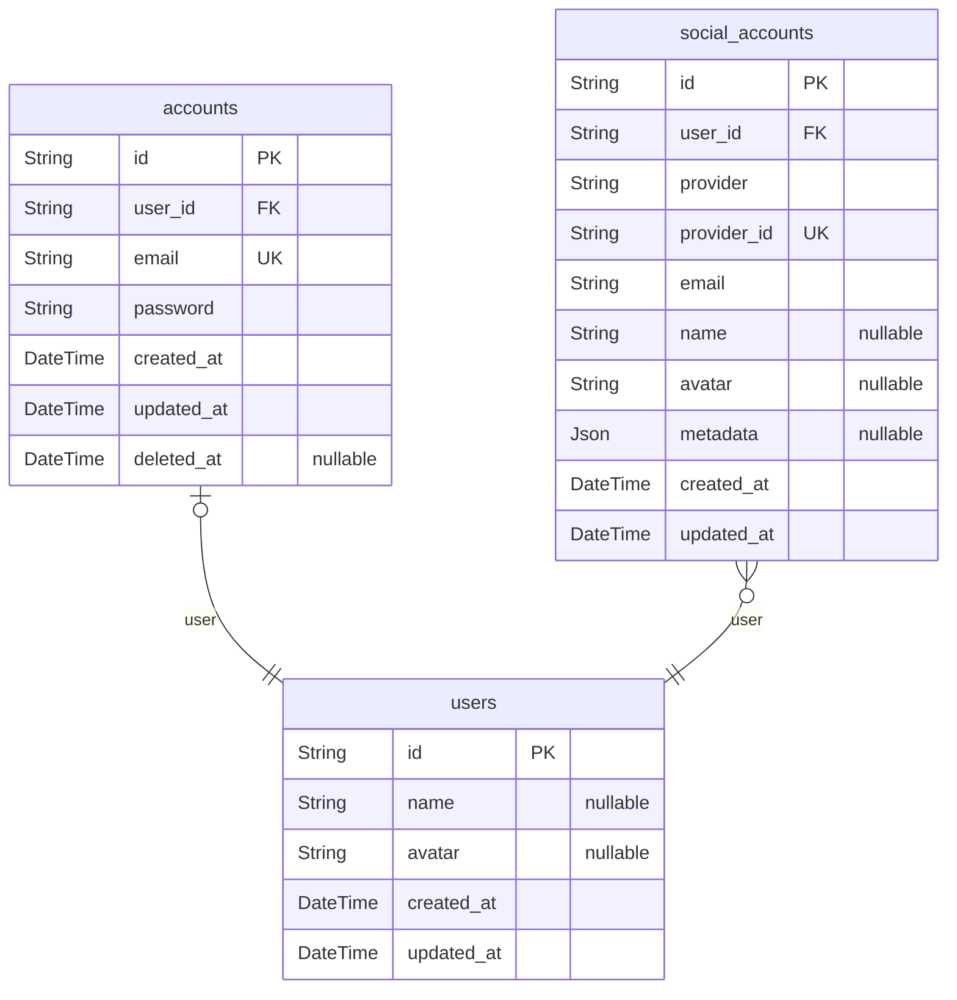

# Backend ERD
> Generated by [`prisma-markdown`](https://github.com/samchon/prisma-markdown)

- [default](#default)

## default

### `users`

**Properties**
  - `id`: 
  - `name`: 
  - `avatar`: 
  - `created_at`: 
  - `updated_at`: 

### `accounts`

**Properties**
  - `id`: 
  - `user_id`: 
  - `email`: 
  - `password`: 
  - `created_at`: 
  - `updated_at`: 
  - `deleted_at`: 

### `social_accounts`

**Properties**
  - `id`: 
  - `user_id`: 
  - `provider`: 
  - `provider_id`: 
  - `email`: 
  - `name`: 
  - `avatar`: 
  - `metadata`: 
  - `created_at`: 
  - `updated_at`: 