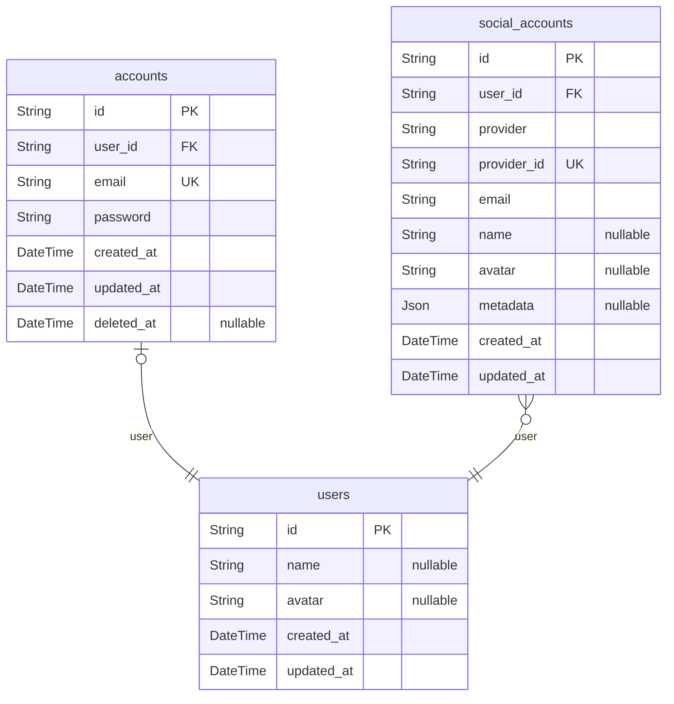

# NestJS Enterprise Template

## 🏗️ 기술 스택

### Backend

- **NestJS + Nestia**

  - `@nestia/core`를 활용한 타입 안전한 API 개발
  - OpenAPI 기반 자동 문서화 지원
  - DTO와 `@TypedRoute`, `@TypedBody` 등의 타입 안전 기능 활용

- **Prisma + PostgreSQL**
  - AWS PostgreSQL을 데이터베이스로 사용
  - UUID v7을 기본 ID 형식으로 사용
  - 트랜잭션과 페이지네이션 처리 지원

### 🔐 인증 시스템

- JWT 기반 인증
- AccessToken은 쿠키/헤더로 처리
- 향후 RefreshToken + 세션 기반 확장 고려 중

## 📊 데이터 모델

### ERD (Entity Relationship Diagram)



### 테이블 구조

#### users

- 기본 사용자 정보 관리
- 필드:
  - `id`: UUID v7
  - `name`: 사용자 이름 (nullable)
  - `avatar`: 프로필 이미지 URL (nullable)
  - `created_at`: 생성 시간
  - `updated_at`: 수정 시간

#### accounts

- 이메일/비밀번호 기반 계정 관리
- 필드:
  - `id`: UUID v7
  - `user_id`: users 테이블 참조
  - `email`: 이메일 (unique)
  - `password`: 암호화된 비밀번호
  - `created_at`: 생성 시간
  - `updated_at`: 수정 시간
  - `deleted_at`: 삭제 시간 (nullable)

#### social_accounts

- 소셜 로그인 계정 관리
- 필드:
  - `id`: UUID v7
  - `user_id`: users 테이블 참조
  - `provider`: 소셜 제공자 (예: google, github)
  - `provider_id`: 소셜 제공자의 사용자 ID
  - `email`: 이메일
  - `name`: 사용자 이름 (nullable)
  - `avatar`: 프로필 이미지 URL (nullable)
  - `metadata`: 추가 메타데이터 (JSON, nullable)
  - `created_at`: 생성 시간
  - `updated_at`: 수정 시간

## 💻 개발 가이드라인

### 코드 스타일

- 타입 안전성 최우선
- RESTful API 설계
- 공통 `HttpExceptionFilter`를 통한 에러 처리
- 서비스 레이어에서 PrismaClient 직접 사용
- 직접적인 SQL 작성 지양
- Fat Controller 지양

### Prettier 설정

- 세미콜론 사용 (`semi: true`)
- 모든 곳에 후행 쉼표 사용 (`trailingComma: "all"`)
- 작은따옴표 사용 (`singleQuote: true`)
- 한 줄 최대 길이 120자 (`printWidth: 120`)
- 들여쓰기 2칸 사용 (`tabWidth: 2`)
- 줄 끝 문자 자동 처리 (`endOfLine: "auto"`)

## 🛠️ 개발 환경

### 패키지 매니저

- pnpm 사용

### 코드 포맷팅

```bash
npm run format
```

### Nestia 예시

```typescript
@TypedRoute.Post()
async createExpense(@TypedBody() body: CreateExpenseDto) {
  return this.expenseService.create(body);
}
```

